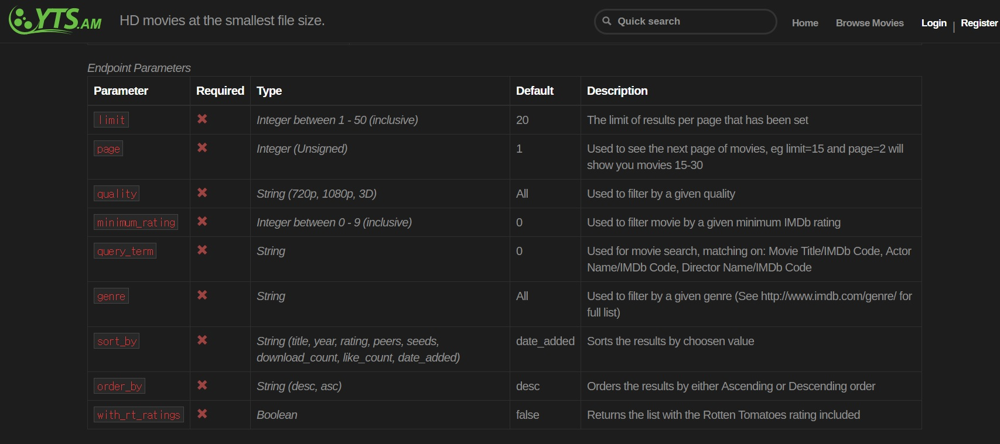
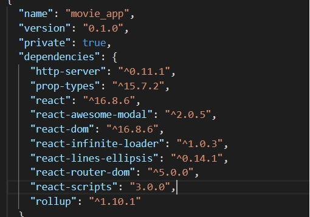
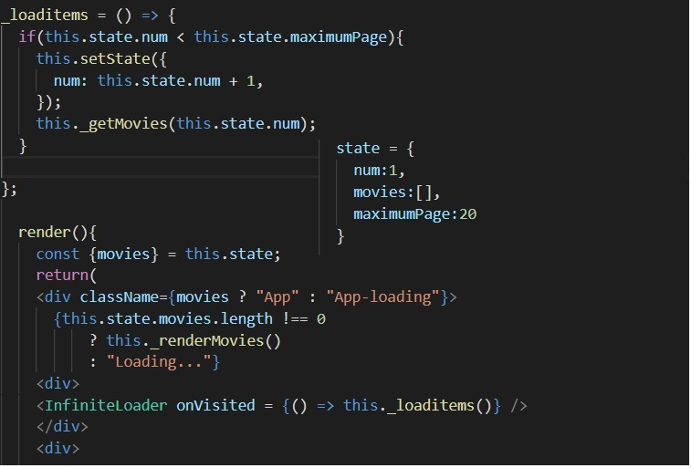
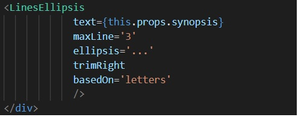
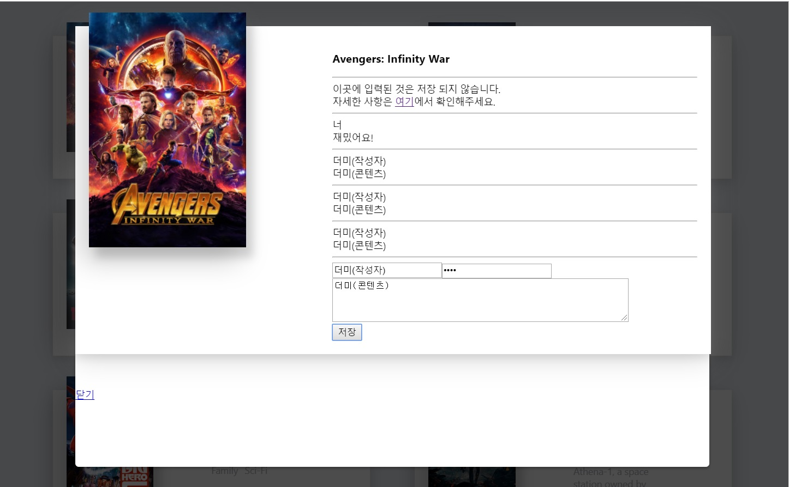

## 목적
* 토렌트 API를 이용한 영화 트렌드 조사 및 댓글.

## 개발환경
### Front-End
* Javascript
* React

### Back-End

* Nodejs(예정)
* MongoDB(예정)

## 주요기능
* fetch를 이용한 API 호출(원하는 형태로 호출 가능)
```javascript
_callApi = () => {
    return fetch("https://yts.am/api/v2/list_movies.json?sort_by=download_count")
    .then(response => response.json())
    .then(json => json.data.movies)
    .catch(err => console.log(err))
}
  ```
  
  
  * 라이브러리를 이용한 각종 기능(Infinite-loader, React-awesome-modal, Lines-ellipsis, Prop-types)
 
  
  
  
  
  
 
 Infinite-loader를 이용해 페이지 가장 하단으로 스크롤 할시 다음 콘텐츠 호출.
 
 
 
 
 
 Lines-ellipsis를 이용한 시놉시스 3줄이후 ... 표시
  
  
  
  
 
  Modal을 이용한 팝업 댓글 및 시놉시스 상세보기.
  
 ```javascript
 <div className="Movie__Synopsis" onClick={() => this.openModal()}>
          <LinesEllipsis
                      text={this.props.synopsis}
                      maxLine='3'
                      ellipsis='...'
                      trimRight
                      basedOn='letters'
                      />   
 </div>
 ```
 
  * 댓글(추후 백엔드 기능으로 삭제예정)
 ```javascript
 class ReplyForm extends Component{
  state = {
    writer : '',
    content : ''
  }

  changeForm(e){
  this.setState({[e.target.name]:e.target.value});
}
  render(){
    const textarea_style = {
      width: '80%'
    };
    return(
  <form onSubmit={function(e){
    e.preventDefault();
    this.props.onSubmit(this.state)
    
  }.bind(this)}>
    <input type="text" placeholder="작성자" name="writer" onChange={this.changeForm.bind(this)}></input>
    <input type="password" placeholder="*****" ></input><br />
    <textarea cols="50" rows="4" style={textarea_style} name="content" onChange={this.changeForm.bind(this)}></textarea><br />
    <input type="submit" value="저장" />
  </form>
  -------------------------------------------------------------------------------------------------------------------------------
  <Reply data={this.state.replys} key={this.state.replys.id}></Reply>
      <ReplyForm onSubmit={function(formData){
        this.lastId = this.lastId +1;
        formData.id = this.lastId
        var newContents = this.state.replys.concat(formData);
        this.setState({
          replys: newContents
        });
        console.log(newContents)
      }.bind(this)}></ReplyForm>
      <div>
  )
  }
}
 ```
 
 
 
 CSS를 통해 모바일 접근시 콘텐츠 표현방식 변경(한줄)
 
 ```CSS
 @media screen and (min-width:320px) and (max-width:667px){
    .Movie{
        width:100%;
    }
}

@media screen and (min-width:320px) and (max-width:667px) and (orientation: portrait){
    .Movie{
        width:100%;
        flex-direction: column;
    }
    .Movie__Poster{
        top:0;
        left:0;
        width:100%;
    }
    .Movie__Columns{
        width:100%!important;
    }
}
 ```
 
 
  ## 보완점 및 후기
  
  * 보완점 및 추가 하고 싶은 것
    1. 백엔드(Nodejs) / DB 를 이용한 댓글 데이터 관리. (현재는 state로 현재페이지에서만 유지 가능)
    2. 크롤링을 통한 네이버 리뷰 수집
    3. Redux를 이용한 state관리
    
  * 후기
  
 초기 구상엔 Modal을 이용하지 않고 react-router를 이용해 Url-query로 파라미터를 받아 상세보기와 댓글 페이지를 구현하려고 했습니다.
싱글페이지(SPA)로 만드려고하니 데이터 관리의 어려움으로 인해 router보다는 Modal이 좋을 것 같은 생각에 수정했다 전체를 수정 하느라 시간을 많이 소비했습니다. 정확한 설계의 중요성을 다시한번 깨닫게 됐습니다. 또 데이터 관리의 어려움으로 인해 전체적인 데이터 관리가 필요하다 생각되어 Redux의 필요성을 느꼈습니다. 차후에 Redux를 통한 데이터 관리가 필요하다고 느꼈습니다.

 깃허브 페이지에서 프론트엔드만 가능한 정적인 페이지 호스팅이 가능하다는 것을 알았고, 그것을 바탕으로 React를 이용해 API및 댓글 시스템을 만들었습니다. 댓글 시스템 같은경우엔 백엔드 기능을 배제했기 때문에 단순히 댓글 생성과 리스트 열람 밖에 제공하지 않습니다만 차후에 백엔드 기능을 추가해서 CRUD를 만들 생각입니다.

 Nodejs를 공부하다가 MEAN STACK 이라는 것을 알게되어 백엔드(MongoDB, Express, Nodejs)를 공부했고 프론트엔드는 AngularJS 보다는 React가 낫겠다는 생각에 React프로젝트를 만들게 되었습니다. 처음엔 JavaScript는 단순한 동적인 페이지 제공만 한다고 생각했지만 이번 노드부터~ React 까지 알아오면서  백엔드 서버까지 구현이가능하단 사실에 JavaScript의 강력함에 놀랐습니다. 이번 프로젝트를 계기로 여러가지 프로그래밍 언어를 접하고 끊임없이 새로운 것을 배워야겠다는 생각이 들었습니다.
 
 
  
  
Static 페이지는 <https://sascill.github.io/movie_app/> 에서 확인할 수 있습니다.
 
